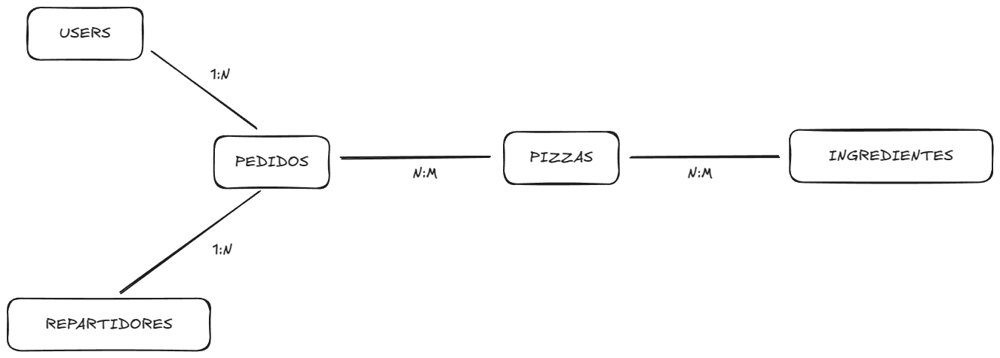

# Pizzería

Aplicación para gestionar una Pizzería.


# Descripción

La aplicación tiene las siguientes características:

- Es instalable en PC y móvil, es decir es una aplicación web progresiva (PWA)
- Permite el registro de múltiples usuarios  
- Existen 2 roles de usuario: ADMIN y USER
  

La aplicación tiene las siguientes funcionalidades:

- En la página inicial se muestran todos las pizzas disponibles, que son públicas para todo el mundo.
- Cualquier usuario registrado puede crear pedidos y modificar y eliminar los que ha creado.
- Sólo el usuario con rol ADMIN puede dar de alta nuevas pizzas, así como modificar y eliminar sus datos.
- Los ingredientes para las pizzas sólo pueden crearse, modificarse y eliminarse por el usuario con rol ADMIN.
- Sólo el usuario con rol ADMIN puede dar de alta nuevos repartidores, así como modificar y eliminar sus datos.


## Diagrama E-R




## Desarrollo


1. Crear base de datos `pizzeria`.

2. Clonar repositorio

```
git  clone  https://github.com/jamj2000/nxapp-pizzeria
cd   nxapp-pizzeria
``` 

3. Renombrar .env.example -> .env y revisar DATABASE_URL
```
mv  .env.example  .env
```
 
4. Instalar dependencias

```sh
npm install
```
   
5. Crear tablas a partir del esquema de prisma

```sh
npx  prisma  db  push
```

6. Sembrar las tablas (seed) con datos iniciales 

```sh
npm  run  seed
```

7. Iniciar servidor de desarrollo

```
npm  run dev
```
