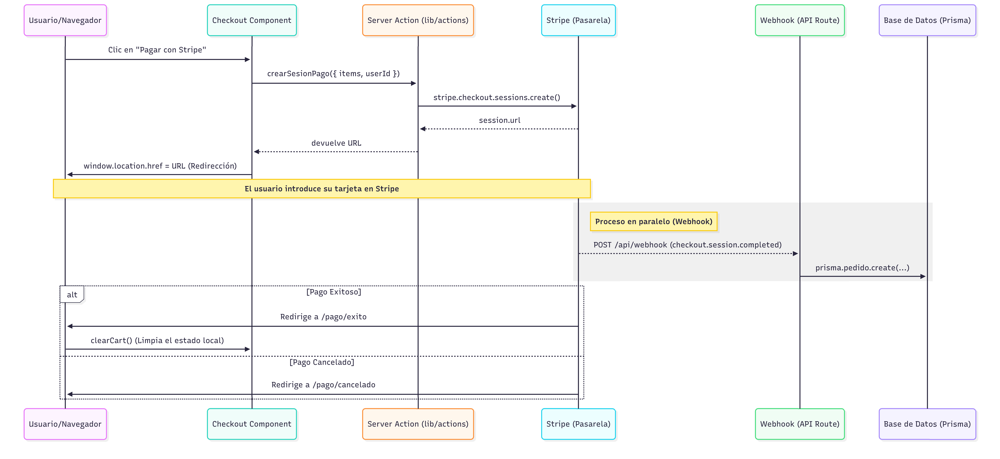

# Implementación de pagos con Stripe

Los pasos para implementar el pago con Stripe han sido los siguientes:

## 1. Crear endpoint de webhook

Crear archivo `src/app/api/webhook/route.js` con el siguiente contenido:


```js
import { headers } from 'next/headers'
import Stripe from 'stripe'

const stripe = new Stripe(process.env.STRIPE_SECRET_KEY)

export async function POST(req) {
  const body = await req.text() // ⚠️ importante: raw body
  const sig = headers().get('stripe-signature')

  let event

  try {
    event = stripe.webhooks.constructEvent(
      body,
      sig,
      process.env.STRIPE_WEBHOOK_SECRET
    )
  } catch (err) {
    console.error('Error verificando webhook:', err.message)
    return new Response(`Webhook Error: ${err.message}`, { status: 400 })
  }

  // 🎯 Manejar eventos
  switch (event.type) {
    case 'checkout.session.completed':
      const session = event.data.object

      console.log('Pago completado:', session.id)

      // 👉 aquí puedes:
      // - guardar en base de datos
      // - enviar email
      // - activar suscripción

      break

    default:
      console.log(`Evento no manejado: ${event.type}`)
  }

  return new Response(JSON.stringify({ received: true }), { status: 200 })
}
```

## 2. Variables de entorno

En archivo `.env`:

```
STRIPE_SECRET_KEY=sk_test_...
STRIPE_WEBHOOK_SECRET=whsec_...
```

## 3. Probar en local con Stripe CLI

Instala Stripe CLI y ejecuta:

```sh 
stripe listen --forward-to localhost:3000/api/webhook
```

Te dará algo como:

```sh
whsec_12345
```

Ese es tu **STRIPE_WEBHOOK_SECRET**

## 4. Simular un pago

```sh
stripe trigger checkout.session.completed
```

Y verás en tu consola:

Pago completado: cs_test_123


**Cosas importantes (muy típicos errores)**

- ❌ NO usar `req.json()` → rompe la firma
- ✅ usar `req.text()` (Stripe necesita el body crudo)
- ✅ verificar siempre la firma (constructEvent)
- ❌ no exponer secretos en frontend


**Flujo completo**

1. Usuario paga
2. Stripe procesa el pago
3. Stripe envía webhook a /api/webhook
4. Tu backend reacciona automáticamente


Dentro del case 'checkout.session.completed' podrías hacer:

```js
await db.orders.create({
  data: {
    stripeSessionId: session.id,
    email: session.customer_details.email,
    amount: session.amount_total,
  },
})
```

## 5. Despliegue

En local, para obtener STRIPE_WEBHOOK_SECRET necesitas hacer

```sh
stripe listen --forward-to localhost:3000/api/webhook
```

> [!IMPORTANT]
>
> En producción (Vercel, etc.), configura el endpoint en el Dashboard de Stripe con la URL real https://tu-dominio.com/api/webhook y actualiza la variable de entorno STRIPE_WEBHOOK_SECRET con el secret que te genere.


## 6. Sesión de checkout en Stripe


